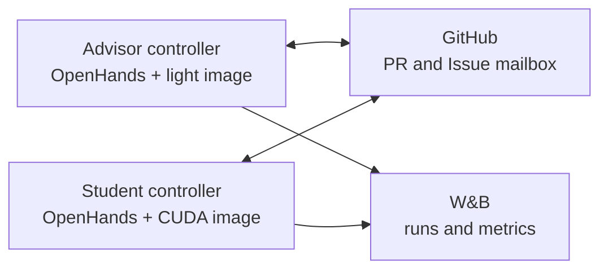

<!--
SPDX-FileCopyrightText: 2026 CoreWeave, Inc.
SPDX-License-Identifier: Apache-2.0
SPDX-PackageName: senpai
-->

# senpai

Senpai is an autonomous ML research loop built on the OpenHands Agent SDK. An
advisor proposes and reviews experiments; GPU students implement one assigned
PR each, train, and return structured evidence. GitHub is the workflow record
and W&B is the experiment record.

Senpai is problem-agnostic. It clones a separate target repository into
`target/`; agent commits, branches, and PRs land there, never in this runner
repository.

The detailed runtime and safety contract is in [SPEC.md](SPEC.md).

## Architecture



GitHub PR labels and human-tagged Issues are the only cross-node protocol.
There is no Senpai network service, port, shared RPC token, cluster DNS
requirement, or Tailscale setup. The same controller works in Kubernetes,
Docker, or directly on a host.

Each entrypoint performs clone and identity setup, then executes one Python
supervisor:

```text
entrypoint
  clone/configure
  exec python -m senpai_agent.supervisor advisor|student

supervisor
  start the controller worker
  restart crashes with bounded backoff
  hard-kill and restart an overdue phase

controller worker
  poll -> reconcile -> bounded OpenHands turn -> verify -> sleep
```

The worker publishes an atomic progress lease for each phase. A restart reuses
the same state directory and conversation UUID, so OpenHands reloads the
conversation through its last durable event. Only an in-flight response or
tool call that had not produced an event can be lost.

The controller owns cadence, conversation selection, durable events, and
training monitoring. OpenHands owns research judgment, code changes, and
evidence interpretation.

## Runtime layout

```text
senpai/
├── senpai_agent/
│   ├── controller.py         # portable poll/reconcile/turn loop
│   ├── supervisor.py         # hard process deadline and restart boundary
│   ├── openhands_runner.py   # one bounded OpenHands turn
│   ├── tools.py              # typed OpenHands tools
│   ├── github.py             # complete, context-bounded PR reads
│   ├── github_workflow.py    # verified GitHub state transitions
│   ├── git_workflow.py       # lease-guarded branch publication
│   ├── training.py           # nonblocking process supervision
│   ├── monitor.py            # deterministic W&B/training monitor
│   ├── advisor.py            # local child-event store and event pump
│   └── hooks.py              # hook CLI and fail-closed policy
├── system_instructions/
│   ├── SENPAI-HARNESS.md
│   ├── SENPAI-ADVISOR.md
│   └── SENPAI-STUDENT.md
├── plugins/senpai/           # native OpenHands plugin, skills, hooks
├── .agents/                  # agents and progressively disclosed skills
├── k8s/                      # entrypoints, launcher, and manifests
├── Dockerfile.advisor        # Chromium; no training stack
├── Dockerfile.student        # CUDA/PyTorch + Chromium
├── senpai.yaml
└── SPEC.md
```

The target repository provides:

```text
target/
├── program.md
└── instructions/
    ├── prompt-advisor.md
    └── prompt-student.md
```

Applicable target `AGENTS.md` and compatible `CLAUDE.md` files are loaded by
OpenHands as project context. Agent skills are presented as a compact catalog
and disclosed only when invoked.

## Typed tools

OpenHands retains its normal Browser, task tracker, and Think facilities.
Senpai wraps the terminal with a fail-closed policy and adds:

- `get_prs`: one read function for explicit numbers, an inclusive date range,
  or a search. It includes every PR body, issue comment, submitted review, and
  inline review comment. Five PRs are returned inline by default. Larger
  results become one Markdown artifact outside the target checkout; raising the
  inline limit above five warns about context pollution.
- `search_conversation_history`: searches the complete active durable event
  branch and returns bounded newest-first snippets. It is an on-demand recovery
  aid, not an automatic replay of old context.
- `github_transition`: creates assignments, performs lease-guarded pushes,
  requests revisions, responds idempotently to exact human Issue messages,
  submits authenticated structured results, reconciles labels, closes, and
  merges.
- `dispatch_agent(task, include_context=false)`: starts a generic,
  independently bounded child and returns immediately. A context-free child
  receives only the normal system prompt and task. With
  `include_context=true`, it also receives the complete model-visible parent
  history.
- `run_training` and `get_training_status`: start and inspect a supervised
  process without streaming raw progress through model history.
- `monitor_training`: records the selected W&B metric, direction, threshold or
  change gates, staleness policy, terminal states, and current conversation
  UUID.

The model-facing terminal denies raw GitHub mutations, `git push`, direct
training launches, sleeps, polling loops, and log streams. Native OpenHands
hooks provide early feedback; the in-process wrapper enforces the same policy
if hooks are bypassed or fail.

## Conversations and monitoring

- The advisor has one durable UUID at
  `/var/lib/senpai/<research-tag>/advisor/openhands_state`.
- A student gets one UUID per assignment revision. A later monitor event
  continues that exact conversation.
- Student state is ephemeral by default. The PR, branch, structured result,
  W&B runs, and Weave trace are the durable handoff.
- Senpai does not prune conversations. Operators own storage retention.
- `human_issues: false` disables human-Issue polling entirely for isolated
  launches.

When a student starts training it registers `monitor_training` and ends the
turn. The controller polls training state and one latest W&B metric value
programmatically. Only a gate, stale metric, or terminal state creates a
compact signal. A fresh context-free child decides whether the signal warrants
waking the main student; failures always wake conservatively. If it wakes, the
controller resumes the same student UUID with the compact conclusion. The
decision is persisted across retries, and the triage child omits browser tools.

While an advisor turn is active, its GitHub watcher can append a new
`review_ready` event through OpenHands' concurrent message path. The advisor is
instructed to dispatch a generic full-context review child and continue its
unrelated research. Child results return through a local SQLite event store;
they are not cross-node messages.

Senpai has two local SQLite databases:

- `advisor-events.sqlite3` stores watcher and generic child-agent events until
  they are injected into the advisor conversation;
- `training/monitors.sqlite3` stores monitor specifications, last samples,
  deduplicated signals, and triage decisions.

Neither is a cross-node queue. OpenHands conversation history is a separate
per-UUID file-backed event log; GitHub and W&B remain the shared records.

## Prompt stack and cache

Senpai keeps harness instructions and role policy as separate source files but
merges them into one stable OpenHands system suffix. `program.md`, the target
role task, current GitHub state, and current UTC time are user-turn context.
The full role is not periodically duplicated because it remains in the system
message on every inference. A persisted merged-context hash detects a changed
deployed harness or role and injects the current text once without rotating the
conversation UUID.

The project pins both OpenHands SDK packages to commit
`da7d76fe3d0b0f5b169ff47c5617a8ecf38a004c` in
[`morganmcg1/software-agent-sdk`](https://github.com/morganmcg1/software-agent-sdk).
That fork tracks OpenHands SDK 1.39.1 and adds a typed Anthropic
`prompt_cache_ttl="1h"` option, durable OpenAI Responses continuation, and an
explicit GPT-5.6 cache boundary. GPT-5.6 marks the stable system block as the
cache breakpoint, uses a stable cache key per role and agent kind, and leaves
dynamic project context outside that boundary. It requests
`prompt_cache_options.mode="explicit"` with a 30-minute TTL. Older compatible
OpenAI models retain `prompt_cache_retention="24h"`. Senpai does not send
Anthropic TTL arguments to OpenAI.

For direct `openai/*` models, Senpai explicitly selects OpenHands' Responses
API path, stores each response, and passes the latest `previous_response_id`
with only the new user or tool inputs. The response ID already lives in the
durable OpenHands event log, so a restarted controller resumes the same
server-side chain. System instructions and tools are still sent on every call.

Senpai requests `reasoning_context="all_turns"` and
`reasoning_summary="auto"`. This allows supported OpenAI models to reuse
private reasoning from earlier turns while returning the most detailed
available reasoning summary. The default reasoning effort is `xhigh`; operators
can still request `max` explicitly for GPT-5.6. OpenAI's automatic Responses
compaction starts at 200,000 rendered tokens. The OpenHands condenser is
disabled only for this stored chain: OpenAI owns the active model context while
OpenHands retains the complete durable event log for restart recovery,
observability, and debugging.

## Images

The image workflow publishes:

```text
ghcr.io/wandb/senpai-advisor:sha-<40-character-source-commit>
ghcr.io/wandb/senpai-student:sha-<40-character-source-commit>
```

Both images are built from the exact same revision, install Chromium, and run
a browser smoke test during the build. The advisor image excludes PyTorch,
CUDA, and Kubernetes tooling. The student image validates CUDA/PyTorch and its
supported architectures.

Build locally:

```bash
revision=$(git rev-parse HEAD)
docker build \
  -f Dockerfile.advisor \
  --build-arg SENPAI_SOURCE_REVISION="$revision" \
  -t "senpai-advisor:sha-$revision" .
docker build \
  -f Dockerfile.student \
  --build-arg SENPAI_SOURCE_REVISION="$revision" \
  -t "senpai-student:sha-$revision" .
```

The launcher accepts only matching full-SHA tags or immutable digests. GitHub
Actions is the canonical image/browser acceptance path when Docker is
unavailable locally.

## Configuration and preflight

`senpai.yaml` supplies defaults; every field can be overridden through
`k8s/launch.py`.

Required launch inputs:

- `--tag`;
- `--target_repo_url`;
- matching immutable `--advisor_image` and `--student_image`; and
- GitHub, Anthropic, Exa, and W&B credentials from the environment or `.env`.

Run checks without deploying:

```bash
uv run python k8s/launch.py \
  --tag preflight \
  --target_repo_url https://github.com/OWNER/TARGET.git \
  --preflight_only
```

Preflight validates repository push access and the target branch, plus the
Anthropic, Exa, and W&B keys. Exa uses one bounded request:
`type=instant`, `category=publication`, `numResults=1`.

## Kubernetes

```bash
uv run python k8s/launch.py \
  --tag july29 \
  --target_repo_url https://github.com/OWNER/TARGET.git \
  --target_repo_branch main \
  --advisor \
  --names frieren,fern \
  --advisor_image "ghcr.io/wandb/senpai-advisor:sha-$revision" \
  --student_image "ghcr.io/wandb/senpai-student:sha-$revision"
```

The launcher verifies credentials and image provenance, creates GitHub routing
labels, writes one launch Secret and per-role ConfigMaps, and deploys the two
role images. It creates no Service, event token, ServiceAccount, or RBAC. A
deterministic ConfigMap/Secret hash rolls pods when effective configuration
changes.

`EXA_API_KEY` powers the researcher agent's direct Exa publication-search tool
through the official `exa-py` library. No Exa MCP server is configured.

```bash
kubectl get deployments -l research-tag=july29
kubectl logs -f deployment/senpai-july29-frieren
kubectl delete deployments,configmaps,secrets -l research-tag=july29
```

## Docker or local hosts

No shared Docker network is required for Senpai communication. Run each
controller wherever it can reach GitHub and W&B. Persist
`/var/lib/senpai/<tag>/advisor` for the advisor. Student `/var/lib/senpai` may
remain ephemeral.

Both role images expose the worker lease as their healthcheck. Use Docker's
`--restart unless-stopped` policy for container-level recovery; the internal
supervisor handles a worker that is alive but no longer making progress.

## Development

```bash
uv sync
uv run pytest -q
bash -n k8s/*.sh scripts/*.sh plugins/senpai/scripts/*.sh
```

The test suite covers tool schemas and role boundaries, complete PR retrieval,
GitHub reconciliation and replay, ambiguous writes, assignment git
integration, local event injection, training supervision, monitoring, hooks,
prompt construction, state topology, image split, launch preflight, and
cluster cutoff.

When `WANDB_ENTITY` and `WANDB_PROJECT` are configured, the pinned
`weave-openhands` integration traces every advisor, student, and child-agent
OpenHands run to that W&B Weave project. It records the agent, LLM, and tool
span tree under the durable OpenHands conversation ID and flushes before each
runner or controller process exits.

Deliberate deferrals:

- Skill-declared child model/reasoning semantics remain in skill frontmatter
  pending native OpenHands support.
- The high-quality default OpenHands condenser remains enabled for providers
  that are not using stored OpenAI Responses continuation.
- Hivemind startup is commented out pending its separate rewrite.
- Senpai imposes no token/cost budget or conversation-retention policy.

## Domain guides

- [LLM Inference Optimization Senpai Guide](LLM-INFERENCE-OPTIMIZATION-SENPAI-GUIDE.md)
- [LLM Training Optimization Guide](LLM-TRAINING-OPTIMIZATION-GUIDE.md)
- [W&B dashboard](https://wandb.ai/wandb-applied-ai-team/senpai-v1)
