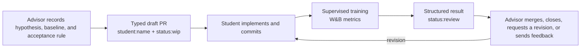
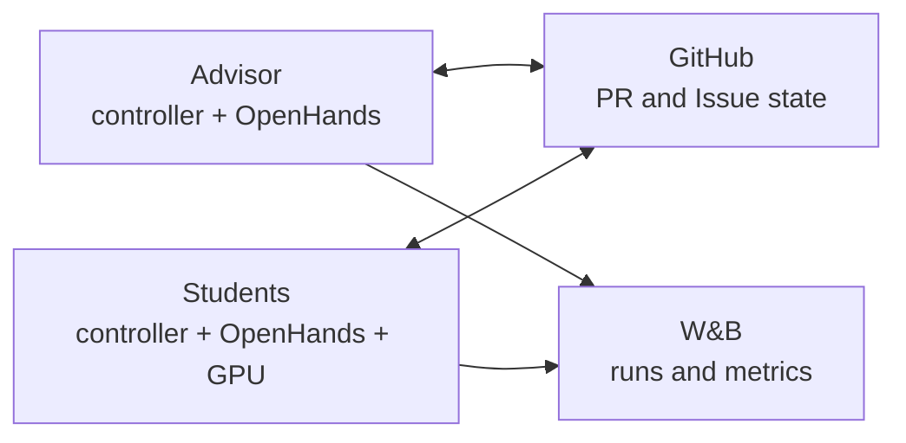

<!--
SPDX-FileCopyrightText: 2026 CoreWeave, Inc.
SPDX-License-Identifier: Apache-2.0
SPDX-PackageName: senpai
-->

# senpai

Senpai is an autonomous ML research loop built on the OpenHands Agent SDK. An advisor proposes and reviews experiments; GPU students implement one assigned experiment each, train, and return evidence through GitHub and W&B.

Senpai is problem-agnostic. It runs against a separate target repository, and every experiment branch, commit, and PR lands there—not in this runner repository.

## Quick start

Kubernetes is currently the turnkey deployment path. The GitHub-based coordination protocol is infrastructure-independent, but Docker and direct-host operation still require manual bootstrap; see [Other deployment environments](#other-deployment-environments).

### 1. Prerequisites

- Python 3.13, [uv](https://docs.astral.sh/uv/), Git, and `kubectl`.
- A Kubernetes context and existing namespace with outbound access to GitHub, Anthropic, Exa, and W&B. Your identity must be able to get, list, create, update, patch, and delete Deployments, ConfigMaps, and Secrets there.
- An existing PVC with enough space for the dataset and advisor state, plus concurrent mounts from every scheduled node—normally `ReadWriteMany`, unless your storage driver explicitly supports another multi-node topology. The launcher mounts this claim but does not create it.
- NVIDIA GPU nodes, the Kubernetes NVIDIA device plugin, and a host driver compatible with CUDA 13 and the shipped student image.
- A target GitHub repository that Senpai can clone and modify.
- Immutable advisor and student images reachable by every cluster node.

### 2. Install Senpai

```bash
git clone https://github.com/wandb/senpai.git
cd senpai
uv sync --locked
```

For development, include the test dependencies:

```bash
uv sync --locked --extra dev
```

### 3. Add credentials

```bash
cp example.env .env
```

Fill in the four values in the gitignored `.env` file:

```dotenv
GITHUB_TOKEN=
ANTHROPIC_API_KEY=
EXA_API_KEY=
WANDB_API_KEY=
```

| Credential | Required access |
|---|---|
| `GITHUB_TOKEN` | Target-repository Contents, Pull requests, and Issues read/write. A classic token with `repo` scope also works. GitHub CLI authentication is the fallback when this value is absent. |
| `ANTHROPIC_API_KEY` | Access to the configured advisor/student model. The default stack uses Anthropic. |
| `EXA_API_KEY` | General-web and research-publication search. |
| `WANDB_API_KEY` | Read/write access to the configured W&B entity and project. |

`k8s/launch.py` reads shell environment variables first and then the repository-root `.env`; only the GitHub token also falls back to `gh auth token`. Direct Docker or host execution must export or pass credentials explicitly.

The launcher places credentials in a per-launch Kubernetes Secret. During bootstrap, the GitHub write token is removed from the process environment and handed to the controller through a one-use channel; it is not exposed to the model or subagents.

### 4. Prepare the target repository

The target branch must contain:

```text
program.md
instructions/
├── prompt-advisor.md
└── prompt-student.md
```

- `program.md` defines the research objective, baseline, metrics, benchmark rules, training limits, and allowed edit surface.
- `prompt-advisor.md` adds target-specific experiment-selection and review guidance.
- `prompt-student.md` adds target-specific implementation, training, and reporting guidance.

Use the [bootstrap-target guide](plugins/senpai/skills/bootstrap-target/SKILL.md) to inspect a new target and create these files. Target `AGENTS.md`, compatible `CLAUDE.md`, and `.agents/skills/` are also loaded through OpenHands project context and progressive disclosure.

The target repository must be different from the Senpai runner repository.

### 5. Configure the launch

Copy the checked-in defaults and replace the W&B, branch, PVC, and resource values for your environment:

```bash
cp senpai.yaml senpai.local.yaml
```

The most important settings are:

```yaml
target_repo_branch: main
advisor_branch: senpai-research

wandb_entity: your-team
wandb_project: your-project

pvc_claim_name: your-existing-pvc
pvc_mount_path: /mnt/data

n_students: 1
gpus_per_student: 1
cpu_per_gpu: 8
memory_gi_per_gpu: 64

timeout_minutes: 30
max_epochs: 50
```

The defaults in `senpai.yaml` describe W&B's deployment and should not be copied unchanged into another environment. Every setting can also be overridden on the command line. `--tag` and `--target_repo_url` are required unless your chosen config file supplies them.

Deployments require matching advisor and student image digests, or `sha-<40-character-commit>` tags built from the same Senpai revision. Digest-pinned images also require the full matching `repo_revision`. The source commit must be fetchable from `repo_url`; PR image checks build but do not publish images.

### 6. Run preflight

```bash
uv run python k8s/launch.py \
  --config_path senpai.local.yaml \
  --tag first-run \
  --target_repo_url https://github.com/OWNER/TARGET.git \
  --preflight_only
```

Preflight authenticates all four credentials, verifies GitHub Contents write access, resolves the target branch, and rejects student labels already carrying active assignments. It deliberately skips image validation and makes no cluster changes. A real launch additionally verifies immutable image syntax and that both role images identify the same source revision.

### 7. Launch

For a Senpai commit whose images have been published:

```bash
revision=$(git rev-parse HEAD)

uv run python k8s/launch.py \
  --config_path senpai.local.yaml \
  --tag first-run \
  --target_repo_url https://github.com/OWNER/TARGET.git \
  --advisor \
  --names frieren \
  --advisor_image "ghcr.io/wandb/senpai-advisor:sha-$revision" \
  --student_image "ghcr.io/wandb/senpai-student:sha-$revision"
```

The launcher creates routing labels, one launch Secret, role ConfigMaps, and Deployments. It does not create the namespace, PVC, Service, or general cluster RBAC.

Inspect and stop the launch:

```bash
kubectl get deployments,pods -l research-tag=first-run
kubectl logs -f deployment/senpai-first-run-frieren
kubectl delete deployments,configmaps,secrets -l research-tag=first-run
```

Use `--kube_context` and `--namespace` when the desired cluster is not your current default. Use `--dry_run` to render redacted manifests without checking credentials or writing to the cluster.

## Experiment workflow

GitHub is both the coordination layer and the durable scientific notebook. W&B is the metric and artifact record.



1. The advisor creates a falsifiable assignment with the exact baseline SHA, baseline metrics, expected mechanism, implementation scope, and stopping rules.
2. `github_transition` creates the student branch and draft PR, embeds a typed assignment record, and applies the routing labels.
3. The assigned student receives one OpenHands conversation for that assignment revision. New PR comments and reviews are injected into that conversation, including while a turn is active.
4. The student commits the exact implementation, launches supervised training, and records every referenced run in W&B.
5. The student submits a typed terminal result. The transition validates and publishes the branch before changing the PR to `status:review`.
6. The advisor compares the evidence, then merges a reproducible winner, closes a useful negative result, requests a new revision, or sends non-revision feedback.

The structured result records its terminal status, exact result commit, W&B run IDs and URLs, bounded conclusion, and baseline/candidate metric comparison when available. Non-revision feedback continues the same student conversation; a revision request intentionally creates a fresh revision identity and conversation.

Trusted collaborator comments, submitted reviews, and inline review comments are delivered automatically to the relevant student; feedback from untrusted authors and unrecognized bots is ignored. `get_prs` can still retrieve the complete discussion explicitly. If the advisor branch advances while an experiment is running, Senpai emits `baseline_advanced`; merging against the stale baseline is blocked until the advisor explicitly accepts the exact new SHA or requests a rerun.

`get_prs` returns complete PR bodies and discussions. Up to five PRs are returned in context by default; larger selections become a Markdown artifact outside the target checkout so long histories do not pollute the main conversation.

## Long-running training and monitoring

Students do not start GPU work, stream logs, sleep, or poll through the terminal. Four typed tools make training a durable controller operation:

| Tool | Contract |
|---|---|
| `run_training` | Accepts structured `argv`, `cwd`, and a hard timeout. It requires a clean assignment worktree, starts a supervised process group without blocking, persists its identity, full log, and bounded error tail, discovers W&B run IDs, and automatically registers terminal-state monitoring for the current conversation. |
| `get_training_status` | Performs one bounded read of the latest persisted state, exit code, elapsed time, W&B run IDs, and error tail. |
| `monitor_training` | Adds a W&B metric, minimize/maximize direction, `lte`, `gte`, `improved_by`, or `regressed_by` gates, a poll interval, and stale-update detection. It cannot disable terminal wakes. |
| `cancel_training` | Stops the complete process group through the supervised TERM/KILL path, waits for a durable terminal state, and retires its monitor. |

After launch, the student can finish its turn. The deterministic controller polls process state and at most one selected W&B metric without consuming model tokens. A threshold crossing, regression, stale metric, terminal state, or monitor error creates one compact durable event and resumes the same student conversation. One broken monitor cannot block other training, GitHub feedback, or child-agent results.

`improved_by` and `regressed_by` compare with the monitor policy's first observed sample; they do not silently reuse the assignment's documented baseline.

Worker and container restarts preserve completed OpenHands events. Recovered live training is terminated safely rather than being adopted under an unverifiable process identity; the original student conversation receives the persisted terminal outcome.

## Subagents

`delegate_agent` is the single delegation interface. Every child runs in a fresh OpenHands conversation and separate process group. A parent may launch up to eight independent children concurrently.

| Agent | Best for | Recommended tier |
|---|---|---|
| [General Purpose](.agents/agents/general-purpose.md) | Bounded work combining investigation, editing, and tests. It can delegate nested foreground work. | `smart` for implementation or review; `fast` for straightforward edits. |
| [Explore](.agents/agents/explore.md) | Read-only search across code, data, experiment artifacts, papers, or durable conversation history. It returns conclusions with paths and line numbers rather than dumping source. | `fast` for mechanical exploration; `smart` when relationships are subtle. |
| [Search](.agents/agents/search.md) | External research through Exa in `general-web` or `research-publications` mode, with primary-source links. | `smart`. |
| [Bash Runner](.agents/agents/bash-runner.md) | Tests, builds, linters, dependency commands, Git inspection, and noisy CLI work. It returns counts and actionable failures rather than raw logs. | `fast`. |

`background=false` waits for the compact result. `background=true` lets the parent continue and delivers the result later through its durable local event store. `include_context=false` sends only the system prompt and task; the child can still search the supplied parent-history directory. `include_context=true` also copies the model-visible parent history.

Children share the parent workspace, so their process and conversation are isolated but their filesystem is not. They receive only their declared tools and never receive GitHub credentials, GitHub workflow tools, or training tools.

## Task guides

OpenHands receives these as progressively disclosed skills; their bodies are loaded only when the task calls for them.

### Core research workflow

| Guide | Purpose |
|---|---|
| [Bootstrap a target](plugins/senpai/skills/bootstrap-target/SKILL.md) | Build `program.md` and the advisor/student overlays from a new ML repository. |
| [Assign an experiment](plugins/senpai/skills/assign-experiment/SKILL.md) | Turn a hypothesis into a typed student branch and draft PR. |
| [Submit experiment results](plugins/senpai/skills/submit-experiment-results/SKILL.md) | Commit the tested implementation and publish a structured, evidence-backed result. |
| [Review an experiment](plugins/senpai/skills/merge-winner/SKILL.md) | Merge a reproducible winner, close a useful negative, or request the missing evidence. |
| [Handle human Issues](plugins/senpai/skills/check-human-issues/SKILL.md) | Respond to authenticated human-to-agent messages delivered through GitHub Issues. |

### Evidence and research

| Guide | Purpose |
|---|---|
| [Senpai status check](.agents/skills/senpai-status-check/SKILL.md) | Produce a bounded, read-only GitHub, W&B, and local-controller status report. |
| [Exa search](.agents/skills/exa-search/SKILL.md) | Search the current web or scholarly publications with mode-specific defaults. |
| [AlphaXiv paper lookup](.agents/skills/alphaxiv-paper-lookup/SKILL.md) | Get a structured overview before reading a primary paper deeply. |
| [W&B and Weave](.agents/skills/wandb-primary/SKILL.md) | Inspect runs, metrics, artifacts, evaluations, and agent traces. |
| [Experiment report](.agents/skills/experiment-report/SKILL.md) | Create the project-standard `nn_cfd` W&B comparison report; this guide is target-specific rather than part of the generic runtime. |
| [Training code style](literature_and_guidance/TRAINING-CODE-STYLE.md) | Structure expensive ML entrypoints so configuration, artifacts, validation, and failure boundaries stay explicit. |

The repository also contains two reusable optimization case studies:

- [LLM inference optimization](LLM-INFERENCE-OPTIMIZATION-SENPAI-GUIDE.md)
- [LLM training optimization](LLM-TRAINING-OPTIMIZATION-GUIDE.md)

## Architecture and durability



There is no Senpai RPC service or cross-node database. GitHub PR labels, typed comments, reviews, and human-tagged Issues are the only advisor/student communication protocol; W&B is the shared experiment store. Role-local SQLite stores local event queues and deduplication plus training-monitor policies; it is never shared across nodes.

Each role runs a small Python supervisor around the deterministic controller:

```text
entrypoint
  clone and configure
  exec supervisor

supervisor
  restart crashed workers with bounded backoff
  terminate and restart an overdue phase

controller
  poll -> reconcile -> bounded OpenHands turn -> verify -> acknowledge -> sleep
```

The controller owns cadence, durable events, conversation selection, GitHub transitions, process supervision, and monitoring. OpenHands owns research judgment, code changes, and evidence interpretation.

- The advisor keeps one durable conversation UUID under `/var/lib/senpai/<tag>/advisor/openhands_state`.
- A student uses one UUID per assignment revision; feedback, monitor events, and background results resume that exact conversation.
- The complete OpenHands event log remains locally searchable. Senpai does not prune conversation directories; operators own retention.
- Student state may be ephemeral because the branch, PR, typed result, W&B runs, and Weave trace are the durable handoff.
- Project `AGENTS.md`, compatible `CLAUDE.md`, and skills are loaded progressively instead of being inlined into every prompt.

The command policy blocks raw GitHub mutations, direct training, `git push`, polling loops, and log streams. Typed transitions enforce repository, branch, assignment, revision, head-SHA, label, and replay preconditions. This policy keeps routine operations deterministic while leaving high-entropy research work to the agent.

When `WANDB_ENTITY` and `WANDB_PROJECT` are configured, [`weave-openhands`](https://github.com/morganmcg1/weave-openhands) traces advisor, student, and child conversations. Each `OPENHANDS_RUN` record includes a direct Weave Agent Observability URL.

## Operations

Useful launch controls:

- `--names frieren,fern` selects stable students; otherwise use `--n_students` and `--student_prefix`.
- `--gpus_per_student`, `--cpu_per_gpu`, and `--memory_gi_per_gpu` size each student.
- `--timeout_minutes` and `--max_epochs` are hard per-training limits.
- `--poll_interval_s` and `--poll_jitter_s` control idle GitHub cadence without teaching the model to poll.
- `--gh_history_scope branch` keeps normal advisor-branch memory, `fresh` creates a shallow ablation checkout, and `repo` exposes full repository history.
- `--extra_instructions` accepts a Markdown file or literal operator guidance.
- `human_issues: false` disables GitHub Issue polling for isolated launches.

Advisor and student images are built from the same source revision. The advisor image excludes CUDA and PyTorch; the student image contains the CUDA/PyTorch runtime; the cutoff image contains only the minimal job runtime and pinned `kubectl`. Advisor and student builds install Chromium and execute an OpenHands browser smoke test.

For multi-day fleets, [`arm_senpai_cluster_cutoff.sh`](scripts/arm_senpai_cluster_cutoff.sh) creates a cluster-side hard cutoff that does not depend on an operator laptop remaining online. It can also hold a shared start gate until the expected fleet is ready or its readiness deadline expires.

Pod startup and liveness probes read the supervisor lease. Restarting a Deployment resumes the durable advisor or student conversation when its state directory survives. Stop a container before copying or snapshotting a live advisor state directory.

### Other deployment environments

GitHub coordination works across Docker, cloud VMs, or local hosts without private networking. The current repository does not yet provide a Compose or direct-host launcher: the Kubernetes manifests perform the source clone, environment assembly, skill installation, token handoff, mounts, and entrypoint selection.

To build another launcher, reproduce [entrypoint-advisor.sh](k8s/entrypoint-advisor.sh) or [entrypoint-student.sh](k8s/entrypoint-student.sh), persist `/var/lib/senpai/<tag>/advisor` for the advisor, and use the container healthcheck with a restart policy. Student execution requires Linux, an NVIDIA runtime, and compatible CUDA hardware; Docker Desktop on macOS cannot run the GPU student image.

## Development and reference

```bash
uv sync --locked --extra dev
uv run pytest -q
bash -n k8s/*.sh scripts/*.sh plugins/senpai/scripts/*.sh
```

Deep references:

- [SPEC.md](SPEC.md): canonical runtime, persistence, safety, and acceptance contract.
- [OpenHands plugin](plugins/senpai/README.md): skills and lifecycle hooks.
- [Harness instructions](system_instructions/SENPAI-HARNESS.md): shared agent/tool contract.
- [Advisor instructions](system_instructions/SENPAI-ADVISOR.md) and [student instructions](system_instructions/SENPAI-STUDENT.md): role workflows.
- [OpenHands fork modifications](https://github.com/morganmcg1/software-agent-sdk/blob/main/FORK_MODS.md): provider continuation, compaction, reasoning, and cache changes.
- [Contributing](CONTRIBUTING.md): development and CLA requirements.
- [W&B dashboard](https://wandb.ai/wandb-applied-ai-team/senpai-v1): the default project's experiment record.
