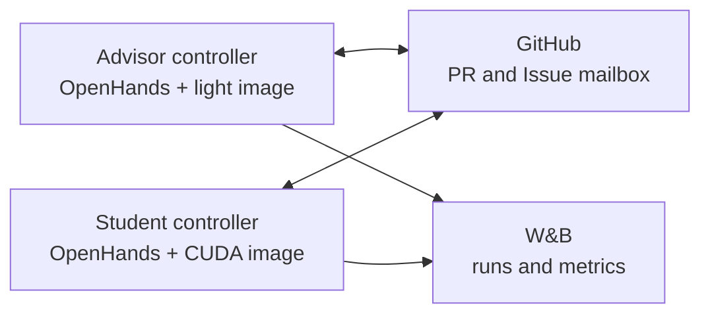

<!--
SPDX-FileCopyrightText: 2026 CoreWeave, Inc.
SPDX-License-Identifier: Apache-2.0
SPDX-PackageName: senpai
-->

# senpai

Senpai is an autonomous ML research loop built on the OpenHands Agent SDK. An advisor proposes and reviews experiments; GPU students implement one assigned PR each, train, and return structured evidence. GitHub is the workflow record and W&B is the experiment record.

Senpai is problem-agnostic. It clones a separate target repository into `target/`; agent commits, branches, and PRs land there, never in this runner repository.

This README is the operator guide. [SPEC.md](SPEC.md) is the canonical runtime, persistence, and safety contract.

## Architecture



GitHub PR labels and human-tagged Issues are the only cross-node protocol. Senpai has no RPC service, shared network token, cluster DNS requirement, or Tailscale setup. The same controller works in Kubernetes, Docker, or directly on a host.

Each role runs:

```text
entrypoint
  clone/configure
  exec python -m senpai_agent.supervisor advisor|student

supervisor
  restart crashed workers with bounded backoff
  terminate and restart an overdue phase

controller worker
  poll -> reconcile -> bounded OpenHands turn -> verify -> sleep
```

The controller owns cadence, durable events, conversation selection, GitHub transitions, and training monitoring. OpenHands owns research judgment, code changes, and evidence interpretation.

The runner repository contains the controller, role images, Kubernetes launcher, OpenHands plugin, typed tools, and shared role instructions. The target repository supplies:

```text
target/
├── program.md
└── instructions/
    ├── prompt-advisor.md
    └── prompt-student.md
```

Applicable target `AGENTS.md` and compatible `CLAUDE.md` files are loaded as project context. Skills are presented as a compact catalog and disclosed only when invoked.

## Agent tools

OpenHands retains its Browser, task tracker, Think, terminal, and file-editing facilities. Senpai adds:

- `delegate_agent`: starts a file-defined `general-purpose`, `explore`, `search`, or `bash-runner` agent with a `smart` or `fast` model tier, optional parent context, and foreground or background delivery. Bash Runner isolates noisy tests, builds, linters, and CLI inspection and returns only counts and actionable failures. Up to eight independent calls run concurrently.
- `get_prs`: reads explicit PR numbers, an inclusive date range, or a search result. It includes the PR body, every issue comment, submitted review, and inline review comment. Five PRs are returned inline by default. Larger results become one Markdown artifact outside the target checkout; raising the inline limit above five risks polluting model context.
- `github_transition`: performs verified, idempotent assignments, branch publication, non-revision feedback, revision requests, human-Issue responses, result submission, label reconciliation, closure, and merging.
- `run_training` and `get_training_status`: start and inspect a supervised process without streaming raw progress through model history. Every launch automatically registers terminal-state monitoring for its conversation.
- `monitor_training`: upgrades the default monitor with a W&B metric, direction, gates, and staleness policy.

The main advisor and student terminal denies raw GitHub mutations, `git push`, direct training launches, sleeps, polling loops, and log streams. The plugin applies the same hook policy to file-defined subagents' raw terminal, while the main terminal also enforces it in process.

File-defined subagents receive only the tools declared by their definition. Bash Runner is terminal-only; General Purpose, Explore, and Search also receive the file editor where their work requires it. They receive no GitHub credential or GitHub mutation tools. Their findings return to the parent, which owns workflow transitions.

`EXA_API_KEY` powers the Search agent's two modes through `exa-py`: general web search and scholarly publication search. Senpai does not configure an Exa MCP server.

## Conversations, recovery, and monitoring

- The advisor keeps one durable conversation UUID under `/var/lib/senpai/<research-tag>/advisor/openhands_state`.
- A student gets one conversation UUID per assignment revision. Monitor and child-agent events resume that same UUID.
- OpenHands reloads a conversation through its last durable event after a worker or container restart. Only an in-flight model response or tool call that had not produced an event can be lost.
- Student state may be ephemeral. The PR, branch, structured result, W&B runs, and Weave trace are the durable handoff.
- Senpai does not prune conversations. Operators own storage retention.
- Set `human_issues: false` to disable human-Issue polling for isolated launches.

Before training, the student commits the exact implementation it will run. `run_training` immediately registers terminal-state monitoring; the student calls `monitor_training` only to add useful metric gates or staleness policy, then ends its turn. The controller polls process state and the latest selected W&B metric without putting routine samples into model history. A gate, stale metric, terminal state, or bounded monitor failure creates one compact persisted signal and directly resumes the original student conversation. Individual monitor failures do not block other monitors or GitHub events.

The advisor watches GitHub while a turn is active and can receive a new `review_ready` event through OpenHands' concurrent message path. Advisor and student child-agent results use role-local durable event storage; they are not cross-node messages. A result arriving after a turn ends wakes the exact parent conversation.

Agents can search their complete local OpenHands event history beneath `$SENPAI_OPENHANDS_STATE_DIR/$SENPAI_CONVERSATION_ID/events/`. Those JSON files can be large, so role instructions recommend `rg`, bounded reads, and a context-free Explore child for broad recovery.

For provider-specific Responses continuation, server-side compaction, reasoning, and cache behavior, see [SPEC.md](SPEC.md) and the OpenHands fork's [FORK_MODS.md](https://github.com/morganmcg1/software-agent-sdk/blob/main/FORK_MODS.md). Dependency revisions are pinned in `pyproject.toml` and `uv.lock`.

## Images

The image workflow publishes:

```text
ghcr.io/wandb/senpai-advisor:sha-<40-character-source-commit>
ghcr.io/wandb/senpai-student:sha-<40-character-source-commit>
ghcr.io/wandb/senpai-cutoff:sha-<40-character-source-commit>
```

All images are built from the same revision. Advisor and student install Chromium and run a browser smoke test during the build. The advisor excludes PyTorch, CUDA, and Kubernetes tooling. The student validates CUDA/PyTorch and its supported architectures. The cutoff image contains a minimal runtime and checksum-verified `kubectl`.

Build locally:

```bash
revision=$(git rev-parse HEAD)
docker build \
  -f Dockerfile.advisor \
  --build-arg SENPAI_SOURCE_REVISION="$revision" \
  -t "senpai-advisor:sha-$revision" .
docker build \
  -f Dockerfile.student \
  --build-arg SENPAI_SOURCE_REVISION="$revision" \
  -t "senpai-student:sha-$revision" .
docker build \
  -f Dockerfile.cutoff \
  --build-arg SENPAI_SOURCE_REVISION="$revision" \
  -t "senpai-cutoff:sha-$revision" .
```

The launcher accepts only matching full-SHA tags or immutable digests. GitHub Actions is the canonical image and browser acceptance path when Docker is unavailable locally.

## Configuration and preflight

`senpai.yaml` supplies defaults. Every field can be overridden through `k8s/launch.py`.

Required launch inputs:

- `--tag`
- `--target_repo_url`
- matching immutable `--advisor_image` and `--student_image`
- GitHub, Anthropic, Exa, and W&B credentials from the environment or `.env`

Run checks without deploying:

```bash
uv run python k8s/launch.py \
  --tag preflight \
  --target_repo_url https://github.com/OWNER/TARGET.git \
  --preflight_only
```

Preflight verifies repository push access, the target branch, image provenance when images are supplied, and the Anthropic, Exa, and W&B keys. Exa uses one cheap bounded request with `type=instant`, `category=publication`, and `numResults=1`.

Common launch controls:

- `--names frieren,fern` selects stable student identities; otherwise `--n_students` and `--student_prefix` generate them.
- `--kube_context` selects a kubectl context; `--namespace` scopes every apply, discovery, monitor, and stop command (default: `default`).
- `--gpus_per_student`, `--cpu_per_gpu`, and `--memory_gi_per_gpu` size each student independently.
- `--timeout_minutes` and `--max_epochs` are hard limits on each training process. The wall-clock timeout includes process-group termination grace; cleanup cannot extend a run past the configured ceiling.
- `--poll_interval_s` and `--poll_jitter_s` control the outer loop without teaching agents to poll.
- `--gh_history_scope branch` is normal durable track memory, `fresh` is a shallow ablation checkout, and `repo` exposes whole-repository history.
- `--extra_instructions` accepts a Markdown path or literal text and is appended to the generated launch-isolation rules.
- `--dry_run` renders manifests without credential checks or cluster writes.

## Kubernetes

```bash
revision=$(git rev-parse HEAD)
uv run python k8s/launch.py \
  --tag july29 \
  --target_repo_url https://github.com/OWNER/TARGET.git \
  --target_repo_branch main \
  --advisor \
  --names frieren,fern \
  --advisor_image "ghcr.io/wandb/senpai-advisor:sha-$revision" \
  --student_image "ghcr.io/wandb/senpai-student:sha-$revision"
```

The launcher verifies credentials and provenance, creates GitHub routing labels, writes one launch Secret and per-role ConfigMaps, and deploys both roles. It creates no Service, event token, ServiceAccount, or RBAC. A deterministic ConfigMap/Secret hash rolls pods when effective configuration changes.

If a cutoff job releases a gated launch, `--start_gate_path` and the cutoff's `--start-gate-path` must name the same absolute normalized file beneath `--pvc_mount_path`. Both CLIs reject relative and pod-local paths.

Useful operations:

```bash
kubectl get deployments -l research-tag=july29
kubectl get pods -l research-tag=july29
kubectl logs -f deployment/senpai-july29-frieren
kubectl rollout restart deployment/senpai-july29-frieren
kubectl delete deployments,configmaps,secrets -l research-tag=july29
```

Pod startup and liveness probes check the supervisor lease. A failed worker is restarted in place and an unhealthy container is restarted by Kubernetes. Keep the advisor state directory durable across pod replacement if its conversation must survive.

## Docker and local hosts

No shared Docker network is required. Run each controller wherever it can reach GitHub and W&B. Persist `/var/lib/senpai/<tag>/advisor` for the advisor. Student `/var/lib/senpai` may remain ephemeral.

Both role images expose the worker lease through their healthcheck. Use Docker's `--restart unless-stopped` policy for container-level recovery; the internal supervisor handles a worker that remains alive but stops making progress. A Docker deployment must perform the same bootstrap as `k8s/entrypoint-advisor.sh` or `k8s/entrypoint-student.sh`: clone the pinned runner and target revisions, install agent definitions and skills, render the role file, vault the GitHub token, then execute the supervisor. Mount `/var/lib/senpai` when the advisor conversation must survive container replacement.

For direct host development, first perform the clone, identity, skill installation, role rendering, and credential-file steps from the appropriate `k8s/entrypoint-*.sh`. With the same environment and prepared target checkout, the long-running processes are:

```bash
uv run python -m senpai_agent.supervisor advisor
uv run python -m senpai_agent.supervisor student
```

The supervisor health command accepts the role's `controller-lease.json` path and exits nonzero when progress is absent or overdue:

```bash
uv run python -m senpai_agent.supervisor health \
  /var/lib/senpai/openhands_state/controller-lease.json
```

Useful recovery facts:

- Worker restart backoff is bounded and resets after a stable run.
- Controller phase deadlines are visible in `controller-lease.json`.
- Durable event keys prevent already-acknowledged GitHub and child events from replaying as new work.
- A replacement student can reconstruct completed work from its branch, PR, structured comments, and W&B run records even when its local conversation was intentionally ephemeral.
- Do not copy an advisor state directory while its process is running; stop the container before moving or snapshotting it.

## Observability

When `WANDB_ENTITY` and `WANDB_PROJECT` are configured, `weave-openhands` traces advisor, student, and child-agent runs to that W&B Weave project. It records agent, LLM, and tool spans under the durable OpenHands conversation ID and flushes before each runner or controller process exits. These records live in **Agent Observability**, not legacy Weave Calls: use the `weave_url` printed in `OPENHANDS_RUN` or query `weave.init("entity/project").get_agent_spans()`.

GitHub and W&B remain the shared operational records. Role-local state exists to resume conversations, deduplicate events, supervise processes, and monitor runs; it is not an inter-node queue.

## Development

```bash
uv sync
uv run pytest -q
bash -n k8s/*.sh scripts/*.sh plugins/senpai/scripts/*.sh
```

The suite covers tool schemas and role boundaries, complete PR retrieval, GitHub reconciliation and replay, ambiguous writes, assignment git integration, local event injection, training supervision, monitoring, hooks, prompt construction, state topology, image separation, launch preflight, and cluster cutoff.

Deliberate deferrals:

- Skill-declared child model/reasoning semantics remain in skill frontmatter pending native OpenHands support.
- The high-quality OpenHands condenser remains enabled for providers not using stored OpenAI Responses continuation or Anthropic native compaction.
- Hivemind startup remains commented out pending its separate rewrite.
- Senpai imposes no token/cost budget or conversation-retention policy.

## Domain guides

- [LLM Inference Optimization Senpai Guide](LLM-INFERENCE-OPTIMIZATION-SENPAI-GUIDE.md)
- [LLM Training Optimization Guide](LLM-TRAINING-OPTIMIZATION-GUIDE.md)
- [W&B dashboard](https://wandb.ai/wandb-applied-ai-team/senpai-v1)
